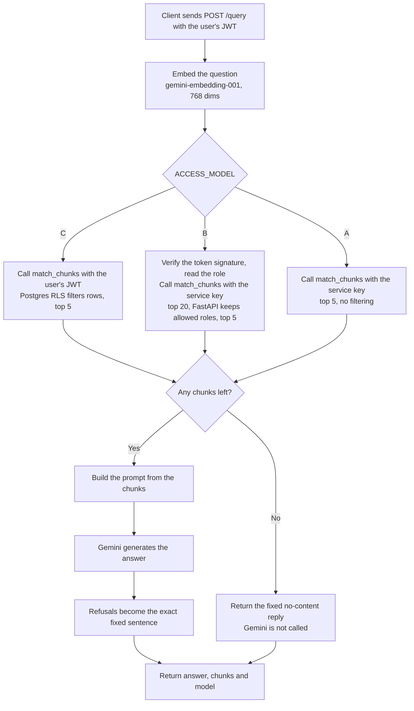

[🏠 Home](./README.md) · [⚙️ Setup](./SETUP.md) · [📡 API Reference](./API_REFERENCE.md) · [🏗️ Architecture](./ARCHITECTURE.md) · [🧪 Testing](./TESTING.md) · [📝 Decisions](./DECISIONS.md)

---

# 🏗️ Architecture

## 📁 Project Structure

```
sentra/
├── frontend/                         # React + TypeScript app (Vite)
│   ├── src/
│   │   ├── assets/
│   │   ├── components/               # Upload UI, chat interface, role-based dashboards
│   │   └── ...
│   ├── tailwind.config.js
│   ├── vite.config.ts
│   └── package.json
├── backend/                          # FastAPI app
│   ├── .env.example                  # Template for required env vars
│   ├── config.py                     # Loads env vars, validates the ACCESS_MODEL flag
│   ├── main.py                       # FastAPI app: /health and /query, Model A/B/C logic
│   ├── prompts.py                    # Builds the LLM prompt, holds the fixed no-content reply, appends sources
│   ├── ingest.py                     # Ingestion: PDF -> chunks -> embeddings -> Supabase
│   ├── requirements.txt              # Python dependencies (pinned)
│   ├── corpus_manifest.csv           # Doc metadata: filename, doc_id, department, sensitivity_level, title
│   ├── corpus/                       # Source documents (PDF) before ingestion
│   ├── sql/                          # Database setup, run in this order:
│   │   ├── create_tables.sql         #   1. documents and chunks tables
│   │   ├── add_chunk_filename.sql    #   2. chunks.filename column and backfill
│   │   ├── match_chunks.sql          #   3. vector search function
│   │   └── rls_chunks_policy.sql     #   4. Row-Level Security policy (Model C)
│   └── test_results/
│       ├── csv_files/                # Test run outputs (CSV and summary .md per run)
│       │   └── ...
│       └── test_scripts/             # Test runners
│           ├── get_tokens.sh         # Fetches fresh JWTs for all 4 test roles
│           ├── sentra_test_common.py # Section 5A matrix, token checks, retries, output writing
│           └── ...
├── docs/
│   ├── Scoping_Document.pdf
│   ├── diagrams/
│   ├── api/                          # OpenAPI & Postman Collections
│   └── reports/                      # Progress reports
├── screenshots/                      # UI preview
├── README.md                         # Home
├── SETUP.md
├── API_REFERENCE.md
├── ARCHITECTURE.md
├── TESTING.md
└── DECISIONS.md
```

---

## 🔄 Pipeline Status

The scoping document describes an eight-stage pipeline. Where each stage stands:

| # | Stage | Status |
|---|---|---|
| 1 | Document upload (web UI) | Planned (Month 2) |
| 2 | Cloud storage of raw files | PDFs are read from `backend/corpus/`; OCI Object Storage is planned (Month 2) |
| 3 | Chunking and embedding | Done: 800 characters, 100 overlap, `gemini-embedding-001` truncated to 768 dims |
| 4 | Vector indexing | Done: Supabase Postgres with `pgvector` |
| 5 | Authenticated query | Done: Supabase Auth JWT, role in `app_metadata` |
| 6 | Filtered retrieval | Done: Postgres RLS (Model C), FastAPI filter (Model B) |
| 7 | Answer generation | Done: Gemini, prompt built in `prompts.py` |
| 8 | Audit logging | Planned (Month 3) |

---

## 🔍 Query Flow

What happens on `POST /query`:



Model C is the design under test: restricted rows are filtered inside the database, so they never reach the backend or the language model.

---

## 🗄️ Database Schema

Two tables, created by the files in `backend/sql/`.

**`documents`**: one row per ingested file.

| Column | Type | Notes |
|---|---|---|
| `id` | `uuid` | Primary key, generated. |
| `filename` | `text` | Required. |
| `uploaded_by` | `text` | Optional. |
| `role` | `text` | Required. Department tag. |
| `created_at` | `timestamp` | Defaults to `now()`. |

**`chunks`**: one row per chunk of text, with its embedding.

| Column | Type | Notes |
|---|---|---|
| `id` | `uuid` | Primary key, generated. |
| `document_id` | `uuid` |The parent `documents` row. Deleting a document deletes its chunks (`on delete cascade`).|
| `content` | `text` | Required. The chunk text. |
| `role` | `text` | Required. Same tag as the parent document. |
| `embedding` | `vector(768)` | `gemini-embedding-001`, truncated to 768 dimensions. |
| `filename` | `text` | Copied from the document so it falls under the chunk's RLS policy. |
| `created_at` | `timestamp` | Defaults to `now()`. |

Every chunk carries one of four tags in `role`: `admin`, `hr`, `legal` or `public`. The manifest's `department` column becomes this value.

**Row-Level Security**

| Table | RLS | Policy |
|---|---|---|
| `chunks` | On | `role_based_chunk_access` (SELECT, `authenticated`): a row is visible if its `role` is `public`, equals the caller's role, or the caller is `admin`. The caller's role comes from `app_metadata.role` in the JWT. |
| `documents` | On | None on purpose. Public clients get no rows; only the service key can read or write it. |

**`match_chunks(query_embedding, match_count)`** returns the nearest chunks by cosine distance, with `id`, `document_id`, `content`, `role`, `filename` and `similarity`. It runs as the caller (no `SECURITY DEFINER`), so RLS applies whenever it is called with a user's JWT.

**Privileges**

| Role | `documents` | `chunks` |
|---|---|---|
| `anon` | None | None |
| `authenticated` | None | `SELECT`, filtered by the RLS policy |
| `service_role` | Full access | Full access |

`service_role` is used by `ingest.py` and by Models A and B. It bypasses RLS, so its key must never be set on the public deployment.

---

## 🔀 Model A / B / C

The same code runs in three configurations, chosen once per server start by `ACCESS_MODEL`. Only the layer that enforces access changes.

| | Model A | Model B | Model C (default) |
|---|---|---|---|
| Purpose | Worst-case baseline (dev only) | Application-layer authorization | Retrieval-layer authorization (Sentra) |
| Key used for the database call | Service key | Service key | User's own JWT |
| Who enforces access | Nobody | FastAPI, after retrieval | Postgres RLS, inside the search |
| Role read from | Not used | JWT `app_metadata.role`, signature and expiry verified in FastAPI (ES256, public keys cached) | JWT, verified by Supabase |
| Chunks fetched, returned | 5, 5 | 20, up to 5 | 5, always 5 at demo scale (no vector index)|
| Do restricted rows reach the backend? | Yes | Yes, then dropped | No |
| Extra requirement | `SUPABASE_SERVICE_KEY` | `SUPABASE_SERVICE_KEY` | None |

The prompt and the generation model are identical in all three. 
Model B verifies the token signature so a forged token cannot claim a role, which keeps the comparison with Model C fair. See [Decisions](./DECISIONS.md).

---

## 🚀 Deployment (planned)

| Part | Where |
|---|---|
| Frontend | Vercel |
| Backend | Vercel |
| Database and auth | Supabase |
| Raw document storage | OCI Object Storage (planned) |

---

## 🌿 Branch Strategy

| Branch | Purpose |
|---|---|
| `main` | Stable and protected: PR only |
| `dev` | Active development branch, local changes |
| `vercel` | Hosting demo version only |

**Workflow:** work happens directly on `dev`; `dev` is merged into `main` and cherry-picked to `vercel` keeping the branch stable and the hosted demo in sync.

---
